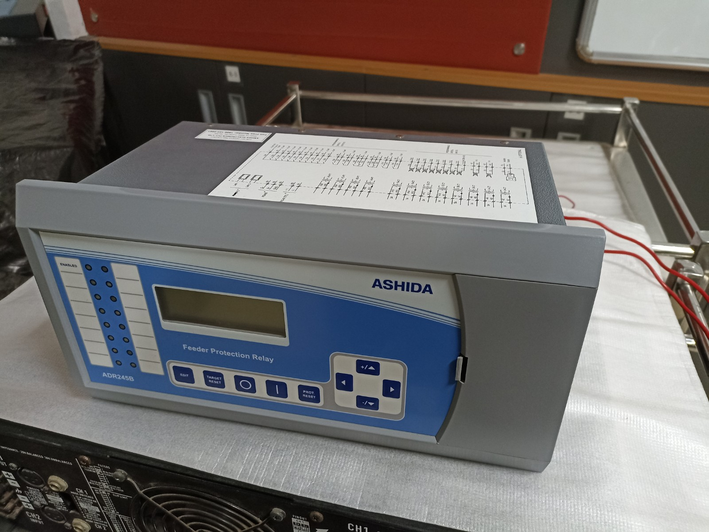
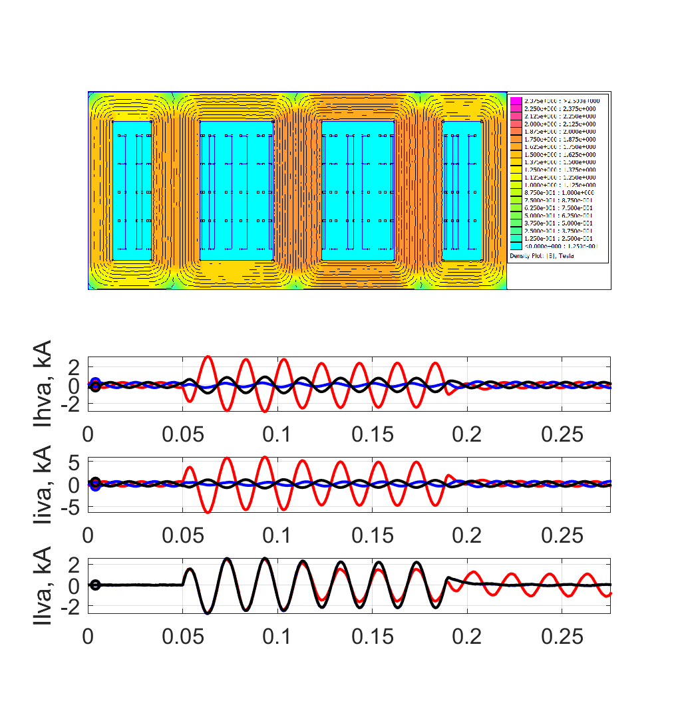

# Testing page
The <code> mkdcos.yml </code> file detail is as shown:

```bash
site_name: My Docs
nav:
   - Home: index.md
   - Testing page: Education.md

theme: readthedocs
extra_javascript:
    - https://cdnjs.cloudflare.com/ajax/libs/mathjax/2.7.0/MathJax.js?config=TeX-AMS-MML_HTMLorMML

markdown_extensions:
    - mdx_math
    - attr_list
    - md_in_html
    - pymdownx.highlight:
         anchor_linenums: true
    - pymdownx.inlinehilite
    - pymdownx.snippets
    - pymdownx.superfences

```

The folder tree is as shown:

```bash
tree /F

│   mkdocs.yml
│
└───docs
   │   Education.md
   │   index.md
   │
   └───img
           Ashida.jpg
           Case_slides.pdf
           Flux_mpptcl.gif

```


The following contents need to be tested:
## 1. Equation entries
### 1.1 Inline equations
```bash
\(\sin(\omega t)\)

\\(\cos(2\omega t)\\)
```
Output:

\(\sin(\omega t)\)

\\(\cos(2\omega t)\\)

---
### 1.2 Equation array
```bash
\begin{align}
a^2 + b^2 &=& 1 \\
a^2 + 2\times b^2 &=& 2\times\hat{V}_1
\end{align}
```
** Output: **
\begin{align}
a^2 + b^2 &=& 1 \\
a^2 + 2\times b^2 &=& 2\times\hat{V}_1
\end{align}
---

## 2. Importing a figure
### 2.1 Figure (or file) on a link

```bash
[Ashida Relay](img/Ashida.jpg)

[Flux in a three-phase transformer](img/Flux_mpptcl.gif)

{width="300"}

{width="350"}

```
Output:

[Ashida Relay](img/Ashida.jpg)

{width="300"}

[Flux in a three-phase transformer](img/Flux_mpptcl.gif)

{width="350"}

---

### 2.2 Display figure with caption

```bash
<figure markdown>
{width="300"}
  <figcaption> Ashida feeder protection relay. </figcaption>
</figure>
```
Output:


<figure markdown>
{width="300"}
  <figcaption> Ashida feeder protection relay. </figcaption>
</figure>

---

## 3. Displaying content in iframe
### 3.1 Display a video link

```bash
<iframe width="400" height="300" src="https://www.youtube.com/embed/5sjm0pat9gY" title="YouTube video player" frameborder="0" allow="accelerometer; autoplay; clipboard-write; encrypted-media; gyroscope; picture-in-picture" allowfullscreen></iframe>
```
Output:

<iframe width="400" height="300" src="https://www.youtube.com/embed/5sjm0pat9gY" title="YouTube video player" frameborder="0" allow="accelerometer; autoplay; clipboard-write; encrypted-media; gyroscope; picture-in-picture" allowfullscreen></iframe>

---

### 3.2 Display a pdf slide

```bash
<iframe width="550" height="480" src="/img/Case_slides.pdf" title="slides" frameborder="0" allowfullscreen></iframe>
```
Output:

<iframe width="550" height="480" src="/img/Case_slides.pdf" title="slides" frameborder="0" allowfullscreen></iframe>

---

## 4. Inserting a Table
### 4.1 Inserting a table
Command:

```bash
Table-1 (contents are center-aligned)

 Method      | Description                          
 :---------: | :----------------------------------:
 `GET`       |      Fetch resource   \( \alpha \)
 `PUT`       |  Update resource
 `DELETE`    |     Delete resource

 Table-2 (contents are left-aligned)

  Method      | Description                          
  :--------- | :----------------------------------
  `GET`       |      Fetch resource  
  `PUT`       |  Update resource
  `DELETE`    |     Delete resource

  Table-3 (contents are right-aligned)

   Method      | Description                          
   ---------: | ----------------------------------:
   `GET`       |      Fetch resource  
   `PUT`       |  Update resource
   `DELETE`    |     Delete resource

```
Output:

Table-1 (contents are center-aligned)

 Method      | Description                          
 :---------: | :----------------------------------:
 `GET`       |      Fetch resource  \( \alpha \)
 `PUT`       |  Update resource
 `DELETE`    |     Delete resource

 Table-2 (contents are left-aligned)

  Method      | Description                          
  :--------- | :----------------------------------
  `GET`       |      Fetch resource  
  `PUT`       |  Update resource
  `DELETE`    |     Delete resource

  Table-3 (contents are right-aligned)

   Method      | Description                          
   ---------: | ----------------------------------:
   `GET`       |      Fetch resource  
   `PUT`       |  Update resource
   `DELETE`    |     Delete resource

---

## Some more need to be done.

**
